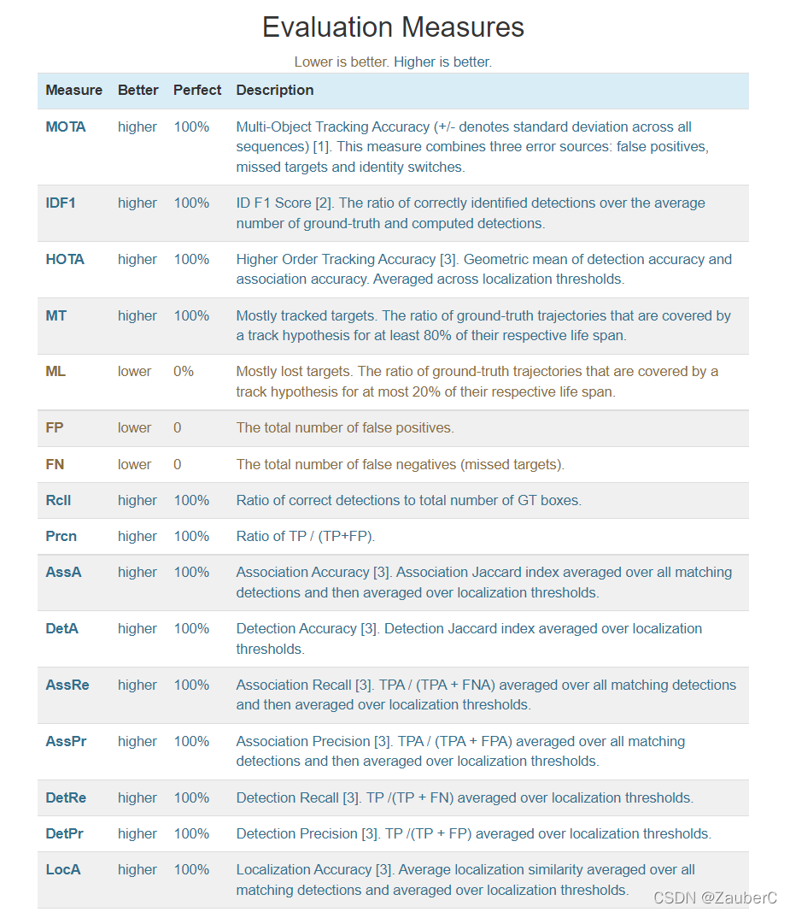
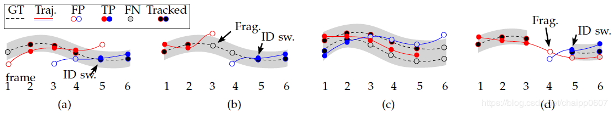

# MOT的评价指标

主要参考[MOT challenge](https://motchallenge.net/)、[博客](https://blog.csdn.net/qq_34919792/article/details/107067992)

- MOTA：
  $$
  MOTA = 1- \frac{\sum_t{(FN_t+FP_t+IDSW_t)}}{\sum_t{GT_t}}
  $$
  其中FN为False Negative，FP为False Positive，IDSW为ID Switch，GT为Ground Truth 物体的数量。MOTA考虑了tracking中所有帧中对象匹配错误，主要是FN，FP，ID Switch。MOTA给出了一个非常直观的衡量跟踪器在检测物体和保持轨迹时的性能，与物体位置的估计精度无关。MOTA取值应小于100，当跟踪器产生的错误超过了场景中的物体，MOTA会为负数。需要注意的是，此处的MOTA以及MOTP是计算所有帧的相关指标再进行平均（既加权平均值），而不是计算每帧的rate然后进行rate的平均。
- MOTP：
  $$
  MOTP = \frac{\sum_{t,i}{d_{t,i}}}{\sum_tc_t}
  $$
  其中，d为检测目标i和给它分配的ground truth之间在所有帧中的平均度量距离，在这里是使用bounding box的overlap rate来进行度量（在这里MOTP是越大越好，但对于使用欧氏距离进行度量的就是MOTP越小越好，这主要取决于度量距离d的定义方式）；而c为在当前帧匹配成功的数目。MOTP主要量化检测器的定位精度，几乎不包含与跟踪器实际性能相关的信息。
- FN&FP&IDs&Frag（用于衡量association(关联)）：

  

  假设GT只有一条，用虚线表示，也就是说在GT中由6帧图像，并只有一个track id。上面由a，b，c，d四张图，涵盖了FN，FP，IDs和Frag的情况。

  在图a中，GT被预测为红蓝两条，红色轨迹F1时并没有匹配上GT，所以GT实际上是一个FN，也就是实际为目标，但是被遗漏了。同理红色轨迹的F1结果，也就是一个FP，因为实际上是一个不存在的东西被判定成了目标。

  同理，蓝色轨迹F3，F4也是FP，又因为GT由4到5时，id从红色变成蓝色，所以存在IDs。

  在图b中，还是同样的GT，这次红蓝两条轨迹没有交叠，在F3的地方GT断开了，所以存在一次Frag。
- measure successes and errors in association (TPAs, FPAs, FNAs)：
  
  HOTA定义的另一种衡量关联的方式。（关联即detection中将pred对应到gt构造双射的过程，只不过不同于简单使用IoU_threshold的方式，可以采用特征提取与数据关联匹配的方式来做）
  - TPA(c)
  - FNA(c)
  - FPA(c)

  这块我还不是很理解，详见[HOTA原论文](https://link.springer.com/article/10.1007/s11263-020-01375-2#Sec8)
  

- [HOTA](https://link.springer.com/article/10.1007/s11263-020-01375-2)：[参考博客](https://cloud.tencent.com/developer/article/1914289#:~:text=HOTA%3A%20A%20Higher%20Order%20Metric%20for,Evaluating%20Multi-object%20Tracking%20%E6%98%AFIJCV%202020%E7%9A%84paper%EF%BC%8C%E5%9C%A8%E6%AD%A4%E4%B9%8B%E5%89%8D%E4%BB%A5MOTChallenge%E4%B8%BA%E4%B8%BB%E7%9A%84%E5%A4%9A%E7%9B%AE%E6%A0%87%E8%B7%9F%E8%B8%AAbenchmark%E4%B8%80%E7%9B%B4%E9%87%87%E7%94%A8%E4%BB%A5%20MOTA%20%E4%B8%BA%E6%8E%92%E5%90%8D%E7%9A%84%E8%AF%84%E4%BB%B7%E6%A0%87%E5%87%86%EF%BC%8C%E8%99%BD%E7%84%B6MOTChallenge%E7%9A%84metrics%E4%B8%AD%E4%B9%9F%E6%9C%89IDF1%EF%BC%8C%E4%BD%86%E6%98%AF%E6%8E%92%E5%90%8D%E8%BF%98%E6%98%AF%E4%BB%A5MOTA%E4%B8%BA%E5%87%86%E3%80%82)，更好地对齐评价得分与人的视觉上的观感
  - 单一指标评价
  - 评估长期高阶跟踪关联
  - 分解为子指标，允许分析跟踪器性能的不同组成部分
