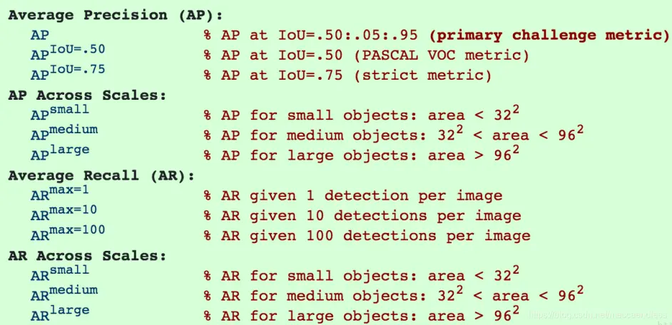

# MSCOCO的评价指标

[参考1](https://www.bilibili.com/read/cv14176041), [参考2](https://blog.csdn.net/perfect_ch/article/details/117480528)。

将目标检测的边界框视为一个查询问题：
- 四类结果：
  - TP (True Positive): 真正例。Positive指预测输出为正，True代表预测正确
  - TN (True Negative): 真反例。预测输出为负，而且预测正确
  - FP (False Positive): 假正例。预测输出为正，但是预测错误
  - FN (False Negative): 假反例。预测输出为负，但是预测错误
- 评价：
  - 查准率precision：TP / (TP+FP)
  - 查全率recall：TP / (TP+FN)
- 对应到目标检测中：可以参考[这篇](https://cloud.google.com/vision/automl/docs/beginners-guide?authuser=1#how_do_i_interpret_the_precision-recall_curves)
  - 给定IoU_threshold，若预测框(True)和真实框的IOU大于阈值，则认为是positive的
  - P-R曲线：
    - 将每个提议框，赋给一个真实框
    - 给定IoU_threshold，按前述方法判定positive
    - 将提议框按置信度从高到低排序，按顺序逐个加入precision、recall的计算中，每加入一个获得一对P-R值，构成P-R曲线
  - AP：Precision-Recall曲线下方面积
    - AP_11、AP_all：详见[参考](http://t.zoukankan.com/itmorn-p-14193729.html)
  - 算AP时，对每个类别分别计算，然后按类别做平均
  - AP：阈值从0.5到0.95，每隔0.05取一次值，算AP后做平均
  - $AP^{IoU=.50}$：阈值取0.5时的AP
  - $AP^{small}$：对小目标的AP

