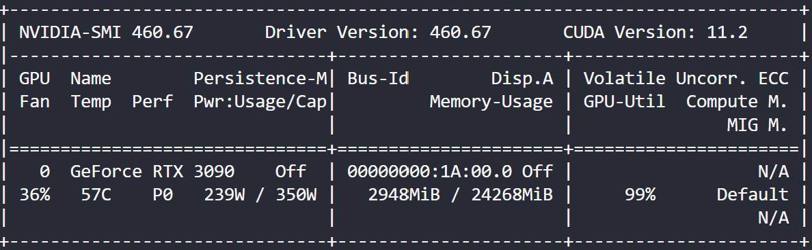

# WongKinYiu: Scaled YOLOv4 & YOLOR

## 0、准备

### 0.1、拉取镜像

我的硬件配置如下：



10张3090，cuda 11.2，NVIDIA Driver 460.67

用的是实验室配好的服务器，英伟达驱动已经装好了

去[nvidia container image for PyTorch官网](https://docs.nvidia.com/deeplearning/frameworks/pytorch-release-notes/rel_21-03.html)，找适合自己硬件和驱动的docker容器镜像，我选了最接近的一个（21.03），因为pytorch适配nvidia驱动是向上兼容（如要求NVIDIA Driver release 460.32.03 or later），选靠后一点点的适配的最好。

从英伟达镜像站拉取镜像：

```bash
nvidia-docker pull nvcr.io/nvidia/pytorch:21.03-py3
```

### 0.2、数据集

1. 下载当时AlexeyAB转好的数据集标签和目录结构：https://github.com/ultralytics/yolov5/releases/download/v1.0/coco2017labels.zip，`your_coco_path`为解压后coco文件夹的绝对路径；

2. 将MSCOCO的图片下载到`your_coco_path/images/`文件夹下，并解压；

   下载链接：http://images.cocodataset.org/zips/ + name，name in ['train2017.zip', 'val2017.zip', 'test2017.zip']；

   文件结构形如：

   ```bash
   ../coco
   ├── LICENSE
   ├── README.txt
   ├── annotations
   │   └── instances_val2017.json
   ├── images
   │   └── train2017					# 训练集图片文件夹
   │   ├── val2017
   │   ├── test2017
   ├── test-dev2017.shapes
   ├── test-dev2017.txt				# 测试集每张图片相对于your_coco_path的路径，按行分割
   ├── train2017.shapes
   ├── train2017.txt
   ├── val2017.shapes
   ├── val2017.txt
   ```

## 1、Scaled YOLOv4

### 1.1、容器构建和环境配置

从[仓库](https://github.com/WongKinYiu/ScaledYOLOv4)clone代码后，`your_code_path`为代码的根目录的绝对路径；

下载他在coco2017上预训练的模型参数，置于`your_code_path/weights/`下；

终端执行下列代码构建环境：

```bash
# create the docker container, you can change the share memory size if you have more.
nvidia-docker run --name yolov4_csp -it --gpus all --net=host -v your_coco_path/:/coco/ -v your_code_path/:/yolo --shm-size=20g nvcr.io/nvidia/pytorch:21.03-py3

# in your container
# install mish-cuda
cd /
git clone https://github.com/JunnYu/mish-cuda
cd mish-cuda
python setup.py build install

# go to code folder
cd /yolo
```

### 1.2、testing

应该是在val2017上验证；在`your_code_path`下，执行：

```bash
python test.py --img 1280 --conf 0.001 --batch 8 --device 3 --data coco.yaml --weights weights/yolov4-p6.pt
```

获得结果如下：

```bash
# yolov4-p6
 Average Precision  (AP) @[ IoU=0.50:0.95 | area=   all | maxDets=100 ] = 0.53857
 Average Precision  (AP) @[ IoU=0.50      | area=   all | maxDets=100 ] = 0.72015
 Average Precision  (AP) @[ IoU=0.75      | area=   all | maxDets=100 ] = 0.59025
 Average Precision  (AP) @[ IoU=0.50:0.95 | area= small | maxDets=100 ] = 0.39285
 Average Precision  (AP) @[ IoU=0.50:0.95 | area=medium | maxDets=100 ] = 0.58283
 Average Precision  (AP) @[ IoU=0.50:0.95 | area= large | maxDets=100 ] = 0.66580
 Average Recall     (AR) @[ IoU=0.50:0.95 | area=   all | maxDets=  1 ] = 0.39552
 Average Recall     (AR) @[ IoU=0.50:0.95 | area=   all | maxDets= 10 ] = 0.66504
 Average Recall     (AR) @[ IoU=0.50:0.95 | area=   all | maxDets=100 ] = 0.72141
 Average Recall     (AR) @[ IoU=0.50:0.95 | area= small | maxDets=100 ] = 0.59193
 Average Recall     (AR) @[ IoU=0.50:0.95 | area=medium | maxDets=100 ] = 0.75844
 Average Recall     (AR) @[ IoU=0.50:0.95 | area= large | maxDets=100 ] = 0.83981
```

## 2、YOLOR

### 2.1、容器构建和环境配置

从[仓库](https://github.com/WongKinYiu/yolor)clone代码后，`your_code_path`为代码的根目录的绝对路径；

下载他在coco2017上预训练的模型参数，置于`your_code_path/weights/`下；

终端执行下列代码构建环境：

```bash
# create the docker container, you can change the share memory size if you have more.
nvidia-docker run --name yolor -it -v your_coco_path/:/coco/ -v your_code_path/:/yolor --shm-size=20g nvcr.io/nvidia/pytorch:21.03-py3

# in your container
# apt install required packages
apt update
apt install -y zip htop screen libgl1-mesa-glx

# pip install required packages
pip install seaborn thop

# install mish-cuda
cd /
git clone https://github.com/JunnYu/mish-cuda
cd mish-cuda
python setup.py build install

# install pytorch_wavelets
cd /
git clone https://github.com/fbcotter/pytorch_wavelets
cd pytorch_wavelets
pip install .

# go to code folder
cd /yolor
```

### 2.2、testing

`yolor_p6.pt`

```bash
python test.py --data data/coco.yaml --img 1280 --batch 32 --conf 0.001 --iou 0.65 --device 0 --cfg cfg/yolor_p6.cfg --weights weights/yolor_p6.pt --name yolor_p6_val
```

获得如下结果：

```bash
 Average Precision  (AP) @[ IoU=0.50:0.95 | area=   all | maxDets=100 ] = 0.52510
 Average Precision  (AP) @[ IoU=0.50      | area=   all | maxDets=100 ] = 0.70718
 Average Precision  (AP) @[ IoU=0.75      | area=   all | maxDets=100 ] = 0.57520
 Average Precision  (AP) @[ IoU=0.50:0.95 | area= small | maxDets=100 ] = 0.37058
 Average Precision  (AP) @[ IoU=0.50:0.95 | area=medium | maxDets=100 ] = 0.56878
 Average Precision  (AP) @[ IoU=0.50:0.95 | area= large | maxDets=100 ] = 0.66102
 Average Recall     (AR) @[ IoU=0.50:0.95 | area=   all | maxDets=  1 ] = 0.39181
 Average Recall     (AR) @[ IoU=0.50:0.95 | area=   all | maxDets= 10 ] = 0.65229
 Average Recall     (AR) @[ IoU=0.50:0.95 | area=   all | maxDets=100 ] = 0.71441
 Average Recall     (AR) @[ IoU=0.50:0.95 | area= small | maxDets=100 ] = 0.57755
 Average Recall     (AR) @[ IoU=0.50:0.95 | area=medium | maxDets=100 ] = 0.75337
 Average Recall     (AR) @[ IoU=0.50:0.95 | area= large | maxDets=100 ] = 0.84013
```

### 2.3、inference

```bash
python detect.py --source inference/images/horses.jpg --cfg cfg/yolor_p6.cfg --weights weights/yolor_p6.pt --conf 0.25 --img-size 1280 --device 0
```

阅读detect.py，用它给的接口做fine tune。

## 3、conda下的环境配置，方便做fine tune

```bash
# create environment
conda create -n yolo python=3.8 -y

# dev_into environment
conda activate yolo

# install pytorch, go https://pytorch.org/ to find your version
conda install pytorch torchvision torchaudio cudatoolkit=11.3 -c pytorch

# install packages
git clone https://github.com/JunnYu/mish-cuda
cd mish-cuda
python setup.py build install
cd ..
git clone https://github.com/fbcotter/pytorch_wavelets
cd pytorch_wavelets
pip install .

# install requirements
conda install -c conda-forge opencv tqdm pyyaml scipy wandb tensorboard pycocotools -y

# soft link your dataset, make sure '../coco' in yolo can get your coco dataset
ln -s /data/workspace/dataset/MSCOCO/coco/ ~/coco
ln -s /data/workspace/dataset/kitti_2d_detection/ ~/kitti_2d_detection
```

